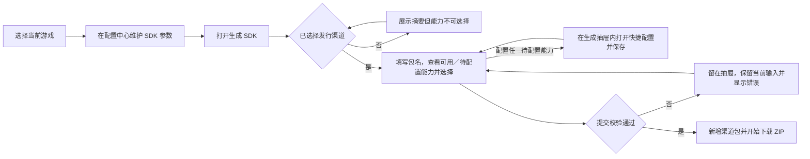
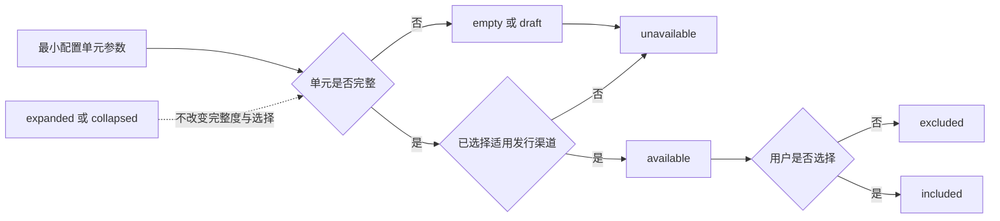
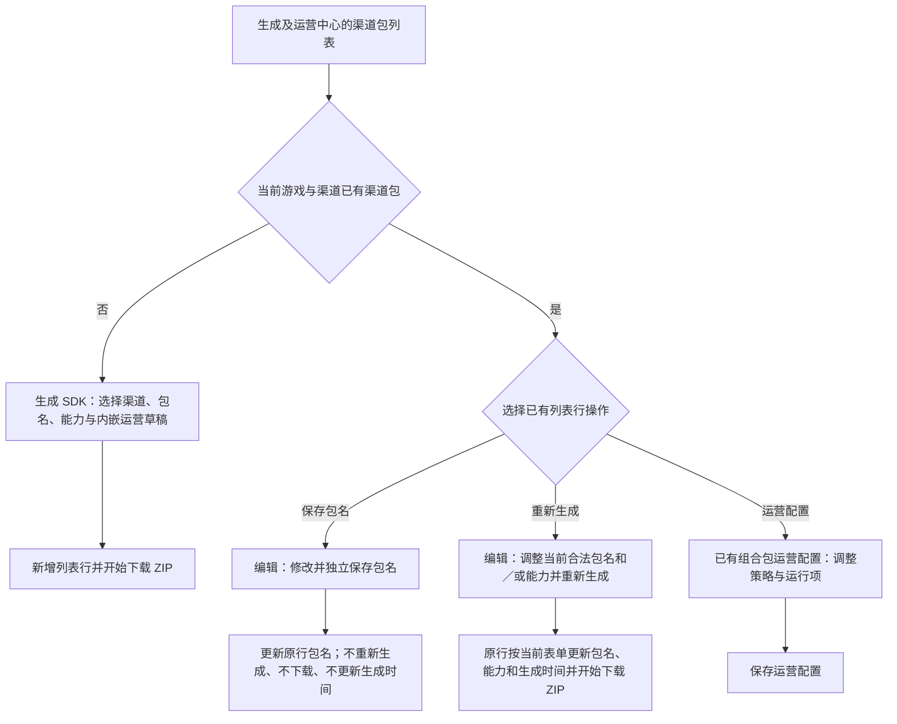

# PRD：MeetGames SDK 配置、组合包生成与运营 V2.5

## 1. 文档定位与使用规则

### 1.1 文档定位

本文档是 MeetGames SDK 管理工具 V2.5 的 Demo 前端等价实现规格，描述前端研发与测试需要复现的页面行为、状态、字段、校验、异常和核心验收场景。
当前 Demo 是本规格的产品行为基线，不是生产技术架构。React 页面状态、DOM 增强、localStorage、浏览器模拟上传及模拟 ZIP 下载均不得直接转化为正式系统设计。

## 2. 产品概述

### 2.1 背景

MeetGames SDK 管理工具面向游戏发行场景，帮助团队按游戏维护可复用的 SDK 接入参数，并针对不同发行渠道选择实际需要的 SDK 能力，生成可交付的渠道组合包，再对组合包中已经包含的能力配置运行策略。
当前核心流程和主要交互已趋于稳定，本 PRD 将把 Demo 已确认行为转换为可开发、可测试的前端规则；Demo 未呈现的内容只记录为未覆盖项，不从旧资料中补齐。

### 2.2 核心问题

当前需要解决的问题包括：
1. “游戏、发行渠道、包名、SDK 能力、平台”等概念容易混淆。
2. 配置中心、组合包生成和运营策略的职责边界需要正式定义。
3. “参数已配置”不等于“参数已进入当前组合包”。
4. 同一能力下可能同时存在完整平台和半成品平台，需要分别判断可用性。
5. 新建和重新生成后会直接下载 ZIP，列表内容、能力选择和下载结果需要保持一致。
6. 包名独立保存与 SDK 能力重新生成是两个不同操作，需要分别描述其页面反馈。
7. 运营配置只能作用于新建时已经选择或当前组合包已经包含的能力，不能改变构建能力集合。
8. 配置变更、关闭页面、保存和放弃修改需要明确的反馈规则。
9. 快捷配置和配置中心虽然有两个入口，但应复用对应字段与完整度规则，并明确支付字段范围、关闭分流和风险提示的信息差异。

### 2.3 方案概述

| 页面／流程 | 用户目的 | 当前 Demo 表现 |
|---|---|---|
| 配置中心 | 选择游戏并维护 SDK 参数 | 展示七类能力卡片及已配置摘要，进入各能力配置界面 |
| 生成 SDK | 选择发行渠道、填写包名并选择 SDK 能力 | 生成成功后直接下载 ZIP，并在列表中展示对应渠道组合包 |
| 编辑组合包 | 修改包名或 SDK 能力 | 包名可单独保存；SDK 能力通过底部“重新生成”写入并重新下载 |
| 新建内嵌运营草稿 | 在新建组合包时维护国家策略组及所选登录、协议、合规运行策略 | 位于“生成SDK”抽屉内，随生成或生成草稿提交，不提供“保存运营配置” |
| 已有组合包运营配置 | 调整已生成组合包的国家策略组及包内登录、协议、合规运行策略 | 从列表行进入独立抽屉，并通过“保存运营配置”提交 |

## 3. 目标用户与文档读者

### 3.1 产品使用角色

| 用户角色 | 核心诉求 |
|---|---|
| SDK 配置人员 | 按游戏查看并维护七类 SDK 参数 |
| SDK 生成／交付人员 | 选择发行渠道、填写包名、选择能力并生成组合包 |
| 发行运营人员 | 按国家或地区维护当前组合包已有能力的运行策略 |

以上角色名称根据页面任务归纳，用于描述使用场景，不代表 Demo 已定义正式账号角色或权限模型。

## 4. 产品目标与质量门槛

### 4.1 产品目标

1. 清晰分离配置中心、组合包生成、组合包编辑和运营配置的职责。
2. 支持按游戏复用七类 SDK 能力参数，并允许安全保存半成品。
3. 按当前发行渠道准确计算最小配置单元的完整度和可用性。
4. 保证组合包只包含用户实际选择且当前页面允许选择的能力或平台。
5. 保证新建和重新生成后的列表信息与下载 ZIP 内容一致。
6. 支持一个游戏、一个发行渠道维护一个用户可见的当前组合包。
7. 区分包名独立保存和 SDK 能力重新生成。
8. 保证运营配置只展示和控制新建时已选择或当前组合包已包含的 SDK 能力。
9. 将未保存提示、风险确认、取消和恢复行为转化为可验收规则。

### 4.2 业务成功指标说明

当前没有可信的生产业务基线、埋点数据和目标值。本版不虚构采用率、效率提升或任务成功率等业务指标。
正式业务 KPI 由产品和数据负责人在获得生产基线后另行补充，不影响本规格的前端功能验收。

## 5. 范围边界

### 5.1 本期纳入

- 游戏选择、添加和编辑入口。
- 支付、登录、协议与隐私、合规、归因数据、广告变现、客服工具七类能力。
- 半成品保存、字段校验、完整度和渠道可用性。
- 配置中心与生成流程快捷配置的一致行为。
- 普通未保存提示和已有组合包时的线上风险确认。
- 单渠道组合包的新建、包名独立保存、能力重新生成和成功后直接下载。
- 一个游戏、一个发行渠道对应一个用户可见的当前组合包。
- 新建草稿、重新生成草稿和已保存包名在页面中的独立状态。
- 新建内嵌运营草稿、已有组合包独立运营配置、国家／地区策略组及包内登录／协议／合规运行项。

## 6. Demo 确认基线

本规格以开发入口当前加载的 `update=54` Demo 为唯一产品确认结果。字段、交互、提示、状态转换和验收场景均以页面可见、可操作结果为准；旧 PRD、历史截图、说明文档和代码中未进入当前运行页面的实现不作为独立确认源。

| 页面／流程 | 当前确认结果 |
|---|---|
| 配置中心 | 按当前游戏展示支付、登录、协议与隐私、合规、归因数据、广告变现、客服工具七张能力卡片 |
| 组合包列表 | 按当前游戏展示发行渠道、SDK 能力、生成时间和操作；行操作仅为“编辑／运营配置” |
| 新建组合包 | 当前支持 App Store、Google Play、ONE Store；同一游戏与渠道已有组合包时不能再次新建 |
| 包名与能力编辑 | 只有一个按渠道格式校验的“包名”字段；包名可独立保存，能力通过“重新生成”提交 |
| 能力选择 | 配置完整不等于进入组合包；归因和广告平台允许取消到零选，半成品不能作为有效能力入包 |
| 生成结果 | 合法新建或重新生成后更新列表并立即开始下载 ZIP；当前没有异步构建状态 |
| 新建运营草稿 | 新建抽屉在已选择能力后展示运营配置区，运营值随生成表单提交或保存草稿 |
| 已有组合包运营配置 | 从列表行进入独立运营抽屉，通过“保存运营配置”提交，不使用独立发布操作 |
| 国家策略 | 支持中文、英文和两位代码搜索，提供全部及六大洲筛选、当前筛选全选和清空 |
| 默认策略 | 允许在已有其他策略时删除；任意时刻至少保留一个策略。删除默认策略后不再回退到全球，仅剩余策略已选择的国家／地区参与发行 |
| 客服工具 | 配置中心四个子模块不提供启停开关；生成页只选择整个客服工具能力；运营配置不展示客服策略 |

## 7. Demo 未覆盖内容

以下内容在当前 Demo 中不可见或无法通过页面操作确认，因此不作为本版 PRD 的已确认需求：

- 远程凭据或第三方连通性验证。
- 将“包名”拆分为应用标识和组合包名称两个字段。
- 正式账号角色、RBAC、审批、审计和敏感字段查看权限。
- 数据传输加密、存储加密和密钥托管方案。
- 多人并发编辑、乐观锁和修订冲突。
- 服务端草稿的保存范围、保留期限和跨设备恢复。
- 构建失败后的原子替换、失败修订和后台版本历史。
- 不可变快照、内部修订号及其服务端数据结构。
- 运营配置的发布、灰度、传播时效和回滚机制。
- 上传文件的生产存储、扫描、版本和回滚机制。
- 正式性能、浏览器支持、国际化和日志留存指标。

后续只有当最新 Demo 增加并可操作验证这些行为时，才将对应内容补入已确认需求。

## 8. 术语、领域对象与状态模型

### 8.1 建模原则

本节把 Demo 中可观察的页面、字段、提示和交互结果转换为前端研发与测试共同使用的规范术语。英文状态名是 PRD 对 Demo 行为的结构化表达，不代表 Demo 已存在同名代码、接口字段或数据库枚举。

状态必须按不同维度独立判断，不得把以下概念合并：

1. 参数是否填写及是否完整。
2. 当前表单是否存在未保存修改。
3. 能力或平台对当前发行渠道是否可选。
4. 用户是否将能力或平台选入本次组合包。
5. 参数面板当前是否展开。
6. 生成表单处于编辑、草稿、校验阻止或已生成结果中的哪一种状态。
7. 运营配置是已同步还是存在未保存修改。

### 8.2 核心术语

| 术语 | 定义 | Demo 中的可观察依据 |
|---|---|---|
| 当前游戏 | 用户在页面顶部“游戏名称”中选中的游戏，也是配置、渠道包列表及生成操作的当前上下文 | 切换游戏后，配置内容和渠道包列表随之切换 |
| 发行渠道 | SDK 组合包面向的商店或发行目标；当前 Demo 展示 App Store、Google Play、ONE Store | “生成SDK”抽屉的“选择发行渠道”区域 |
| 包名 | 渠道包的唯一可编辑名称字段；按渠道分别采用 iOS Bundle ID 或 Android Application ID 的格式提示与校验 | 新建和编辑抽屉均只显示一个“包名”字段 |
| 当前渠道包 | 当前游戏在某一发行渠道下的用户可见组合包记录 | 列表每行对应一个渠道；运营抽屉显示“当前渠道包” |
| SDK 能力 | 可配置并可选择进入组合包的功能类别，共七类：支付、登录、协议与隐私、合规、归因数据、广告变现、客服工具 | 配置中心七张能力卡和生成抽屉七张能力卡 |
| 平台／提供方 | SDK 能力下可独立配置或选择的第三方实现 | 归因数据中的 Firebase、AppsFlyer、Adjust；广告变现中的 Google AdMob、AppLovin MAX |
| 最小配置单元 | PRD 为描述完整度而归纳的最小独立判断对象；不是 Demo 页面原词 | Demo 会分别显示登录方式、协议分组、第三方平台和客服模块的完成情况 |
| 配置摘要 | 配置中心能力卡和生成抽屉中用于展示完整单元的“已配置：…”内容 | 完整单元进入摘要；半成品不作为完整摘要展示 |
| 新建生成草稿 | 用户从“生成SDK”入口开始、尚未生成新渠道包的表单内容 | 关闭已修改的新建抽屉时可选择“保存草稿” |
| 重新生成草稿 | 用户从已有渠道包的“编辑”入口开始、尚未执行重新生成的能力修改 | 关闭已修改的编辑抽屉时可选择“保存草稿” |
| 包名修改 | 编辑已有渠道包时，对包名进行的独立修改 | 合法新包名可通过区块内“保存”提交，不触发重新生成或下载 |
| 生成结果 | 一次提交校验通过后，页面新增或更新渠道包列表行并开始下载 ZIP 的可观察结果 | 新建和重新生成均在成功后提示下载开始 |
| 新建内嵌运营草稿 | 新建组合包尚未生成时维护的运营策略 | 位于“生成SDK”抽屉内，属于新建生成草稿 |
| 已有组合包运营配置 | 依附于已生成渠道包、可独立保存的运营策略 | 渠道包列表行内的“运营配置”入口 |
| 渠道允许范围 | 当前发行渠道可供策略组选择的国家／地区全集 | 添加策略组时的筛选数量依据此集合计算，包含已被其他策略占用的国家 |
| 有效发行范围 | 当前实际有策略承接的国家／地区集合 | 默认策略存在时等于渠道允许范围；默认策略删除后等于现存自定义策略组国家的并集 |
| 默认策略 | 初始存在的兜底策略；存在时承接所有未被自定义策略组占用的国家／地区 | 允许删除，但任意时刻必须至少保留一个策略 |
| 策略组 | 由策略名称、一个或多个未被占用的国家／地区及独立运行配置组成的区域策略 | “添加策略组”弹窗和策略列表 |
| 当前编辑策略 | 运营抽屉中当前正在修改的默认策略或自定义策略组 | 策略项显示“当前编辑” |
| SDK 策略区块 | 运营配置中可按策略调整的 SDK 内容；当前 Demo 仅展示登录 SDK、协议 SDK、合规 SDK | 运营抽屉的三个配置区块 |
| 运行项 | SDK 策略区块内可调整的开关、枚举、选择和顺序 | 登录方式与顺序、协议分组、游客设置、静默登录、合规开关等 |

### 8.3 领域对象关系

| 主对象 | 从属或关联对象 | 关系与边界 |
|---|---|---|
| 游戏 | SDK 配置 | 七类能力的参数均在当前游戏上下文中维护 |
| 游戏 | 当前渠道包 | 一个游戏可按不同发行渠道展示多条记录；同一游戏与渠道已有记录时，新建入口禁用该渠道 |
| SDK 能力 | 最小配置单元 | 一项能力可以包含一个或多个独立单元；其他单元不完整不得使已经完整的单元失效 |
| 新建生成草稿 | 游戏、发行渠道、包名、入包选择、新建内嵌运营草稿 | 未选择发行渠道前仍可查看配置摘要但不能选择能力；运营草稿随生成或生成草稿一并提交 |
| 重新生成草稿 | 当前渠道包、包名、入包选择 | 发行渠道固定；包名保存与能力重新生成分别提交 |
| 当前渠道包 | 已有组合包运营配置 | 只有已有渠道包的列表行提供独立运营配置入口 |
| 运营配置 | 默认策略、自定义策略组 | 默认策略存在时承接未分组国家；默认策略删除后不再提供回退 |
| 策略组 | 国家／地区 | 一个国家／地区不能同时被多个自定义策略组占用 |
| 策略 | SDK 策略区块、运行项 | 新建策略组优先复制默认策略；默认策略已删除时复制当前活动策略 |

Demo 能确认上述用户界面关系，但不能确认服务端实体、主键、数据表或接口结构。

### 8.4 最小配置单元

“最小配置单元”用于判断某一部分参数是否完整。顶层能力卡的“已配置”摘要是完整单元的聚合结果，不代表该能力下所有单元均已完成。

| SDK 能力 | 最小配置单元 | 完整度的聚合方式 |
|---|---|---|
| 支付 | 各发行渠道的支付参数；能力共用的发货地址 | 当前渠道支付参数完整且发货地址为有效 HTTP(S) 地址时，该渠道支付可用于生成 |
| 登录 | 单个非 Guest 登录方式；有参数的方式按通用参数与当前渠道平台参数共同判断 | 当前渠道至少存在一种完整的非 Guest 登录方式时，登录能力可用于生成；Guest 本身不满足该条件 |
| 协议与隐私 | 单个协议分组 | 至少一个协议分组完整时，能力可用于生成；其他未完成分组不使完整分组失效 |
| 合规 | 年龄阈值与整组 KWS 参数 | 整组必填及格式均满足后可用于生成 |
| 归因数据 | 单个归因平台 | 至少一个平台完整时能力可用于生成；只向生成页提供完整平台 |
| 广告变现 | 单个广告平台 | 至少一个平台完整时能力可用于生成；平台是否入包另行选择 |
| 客服工具 | 在线客服、表单反馈、FAQ、智能客服中的单个模块 | 至少一个模块完整时能力可用于生成；未完成模块不使完整模块失效 |

### 8.5 状态模型

#### 8.5.1 配置单元完整度

该状态只用于单个最小配置单元，不直接用于表示整个顶层能力是否“全部完成”。

| 状态 | 判定 | Demo 表现 |
|---|---|---|
| `empty` | 单元没有用户填写的有效内容 | 不进入“已配置”摘要；生成页显示“待配置”或不提供该单元 |
| `draft` | 单元已有部分内容，但未满足全部必填或格式规则 | 可保存；平台或子项可显示“待完善”；不作为可入包单元 |
| `complete` | 单元满足当前 Demo 中的必填和格式规则 | 显示“已配置”或进入能力卡摘要，并参与当前渠道可用性判断 |

配置单元从 `complete` 变回不完整时，应重新按当前值计算为 `draft` 或 `empty`；不得因为它过去曾经完整而继续视为可用。

#### 8.5.2 编辑与保存状态

| 状态 | 判定与转换 | 可观察反馈 |
|---|---|---|
| `clean` | 当前表单与打开或最近一次成功保存后的基线一致 | 关闭配置弹窗不触发未保存提示；已有组合包运营抽屉显示“配置已同步／所有修改已保存” |
| `dirty` | 任一可编辑值、选择或顺序相对基线发生变化 | 配置弹窗关闭时进入未保存或线上风险确认；已有组合包运营抽屉显示“有未保存修改” |
| `saved` | 用户保存后得到成功反馈的瞬时结果，随后以新值作为 `clean` 基线 | 完整配置提示“保存成功”；半成品提示“配置草稿已保存，完成后可用于生成 SDK” |

当前 Demo 没有可验证的 `saving` 或 `error` 页面状态。本节不定义保存中、保存失败、错误码和重试状态；这些内容如后续出现在 Demo 中，再纳入相应章节。

#### 8.5.3 当前渠道可用性

`available` 是 PRD 对生成页可选择行为的规范名，不是 Demo 页面原词。

| 状态 | 原因 | Demo 表现 |
|---|---|---|
| `unavailable(no-channel)` | 尚未选择发行渠道 | 所有能力卡禁用，页面提示先选择发行渠道 |
| `unavailable(incomplete)` | 已选择渠道，但不存在适用于当前渠道的完整单元 | 能力显示“待配置”和“前往配置”，不能选入组合包 |
| `available` | 已选择渠道，且至少一个适用于当前渠道的最小配置单元为 `complete` | 简单能力提供复选；归因和广告提供完整平台的独立选择按钮 |

可用性必须在选择或切换发行渠道后重新计算。配置中心存在完整参数，不等于未选渠道时可选，也不等于用户已经将其放入组合包。

#### 8.5.4 入包状态

| 状态 | 判定 | Demo 表现 |
|---|---|---|
| `included` | 当前生成或重新生成表单中，用户选择了一个 `available` 的简单能力或完整平台 | 简单能力为勾选态；平台按钮为选中态；计入“已选择 N / 7 项能力” |
| `excluded` | 用户未选择、主动取消，或该能力／平台当前不可用 | 不计入本次组合包；归因或广告的最后一个平台取消后，整个能力退出选择 |

选择发行渠道后，Demo 会自动带入当前已配置能力，但用户仍可取消。归因数据与广告变现按平台维护入包状态；平台已配置不代表平台已入包。提交时必须至少存在一项 `included` 能力，否则保留在抽屉并显示校验错误。

#### 8.5.5 参数面板显示状态

| 状态 | 含义 |
|---|---|
| `expanded` | 当前渠道、登录方式或平台的参数面板可见 |
| `collapsed` | 参数面板收起，已填写值仍保留 |

`expanded / collapsed` 只控制参数面板可见性，不得被解释为启用／停用、完整／不完整、入包／不入包、清空或删除。配置中心的平台卡展开状态与生成页的平台选择状态是两套互不替代的状态。

#### 8.5.6 生成表单与结果状态

| 状态 | 进入条件 | 后续行为 |
|---|---|---|
| `editing` | 打开新建或重新生成抽屉，正在填写或修改 | 可继续编辑或提交；存在修改后请求退出时才提供保存草稿分流 |
| `saved-draft` | 关闭有修改的抽屉并选择“保存草稿” | 返回列表；同一页面会话中再次进入可恢复并继续编辑 |
| `validation-blocked` | 点击“生成SDK”或“重新生成”后，未选择发行渠道、包名为空／不符合当前渠道格式／去除首尾空格后超过 150 个字符、未选择任何 SDK 能力，或已选能力因配置变化而不再可用 | 抽屉保持打开并保留当前输入，显示汇总提示及字段／能力错误；不形成 `saved-draft`，不新增或更新列表行，也不触发下载；修改后可再次提交 |
| `generated` | 提交校验通过 | 新建时新增列表行，重新生成时更新原列表行；两者均开始下载 ZIP |

#### 8.5.7 已有组合包运营配置状态

| 状态 | 判定 | Demo 表现 |
|---|---|---|
| `synced` | 当前运营表单与最近一次保存结果一致 | 头部显示“配置已同步”，底部显示“所有修改已保存” |
| `dirty` | 登录方式、顺序、协议选择、运行项或策略组发生变化 | 头部和底部均显示“有未保存修改” |

在已有组合包的独立运营抽屉中，点击“保存运营配置”后抽屉关闭，再次打开可看到保存结果。

#### 8.5.8 本期不建立的状态轴

以下状态在当前 Demo 中没有对应界面、提示或可操作路径，因此不纳入本期状态模型：

- 远程验证：`unverified / verifying / verified / failed / unsupported`。
- 异步构建：排队、构建中、上传中、构建失败、重试中。
- 服务端修订：已提交修订、冲突、覆盖、回滚。
- 用户可见包版本：历史版本、当前版本号、历史下载状态。

### 8.6 状态组合规则

| 场景 | 配置完整度 | 当前渠道可用性 | 入包状态 | 结果 |
|---|---|---|---|---|
| 未选择发行渠道，但配置中心已有完整参数 | 可存在 `complete` 单元 | `unavailable(no-channel)` | `excluded` | 只展示摘要，全部不可选择 |
| 已选渠道，当前渠道所需参数不完整 | `empty` 或 `draft` | `unavailable(incomplete)` | `excluded` | 显示“待配置／前往配置” |
| 已选渠道，普通能力满足当前渠道规则 | 至少一个适用单元为 `complete` | `available` | 初始可被自动带入，用户可切换 | 以能力复选状态决定是否入包 |
| 归因能力中一个平台完整、另一个半成品 | 两个平台分别为 `complete` 与 `draft` | 完整平台 `available` | 仅完整平台可选 | 半成品不拖累完整平台，也不进入组合包 |
| 广告平台均完整，但仅选择一个 | 两个平台均为 `complete` | 两个平台均可作为候选 | 一个 `included`、另一个 `excluded` | 配置完成与实际入包保持分离 |
| 参数面板收起 | 完整度保持原值 | 可用性保持原值 | 入包状态保持原值 | 仅改变界面可见性 |
| 表单有修改但未保存 | 完整度按当前输入实时判断 | 生成页按已保存或当前快捷配置结果展示 | 与保存状态独立 | 关闭时触发对应未保存路径 |

### 8.7 关键流程图

#### 8.7.1 配置中心到新建渠道包

#### 8.7.2 配置完整、渠道可用与入包选择

#### 8.7.3 新建、包名修改、重新生成与运营配置分流

## 9. 配置中心通用规则

### 9.1 目的与边界

配置中心用于在当前游戏上下文中维护七类 SDK 能力参数。配置中心负责参数录入、完整度判断、配置摘要、草稿保存、未保存保护和已有渠道包情况下的风险提示；是否把能力或平台放入某次渠道包，仍由“生成SDK／重新生成SDK”流程决定。

本节描述七类能力共同遵循的页面行为。各能力的字段、必填条件和独有交互在后续能力规格中分别定义。本节不设计接口、数据库或生产持久化方式。

### 9.2 页面结构与游戏上下文

配置中心页面必须包含：

- 页面标题“配置中心”。
- 说明“首次配置用于生成 SDK；后续修改会影响线上已接入的 SDK，请确认变更与风险后保存。”
- “游戏名称”下拉选择。
- “修改当前游戏”按钮。
- “添加游戏”按钮。
- “SDK 配置”区域及说明“按需补充SDK”。

#### 9.2.1 游戏选择

| 规则编号 | 功能要求 |
|---|---|
| FR-CFG-001 | “游戏名称”下拉必须展示当前已有游戏；切换后，页面必须显示目标游戏对应的 SDK 配置和渠道包上下文，并关闭原游戏正在打开的能力配置弹窗。 |
| FR-CFG-002 | 配置、配置摘要和后续生成可用性均必须以当前游戏为边界；切换游戏不得把原游戏的配置摘要显示为目标游戏已配置结果。 |

#### 9.2.2 添加与修改游戏

添加游戏和修改当前游戏均使用模态弹窗，字段如下：

| 字段 | 控件 | 必填 | 当前 Demo 规则 |
|---|---|---|---|
| 游戏名称 | 单行文本 | 是 | 去除首尾空格后不能为空 |
| 游戏类型 | 单选 | 是 | 消除、益智、超休闲、动作、博弈、运动、策略、派对、桌面游戏、儿童类、其他、赛车、角色扮演、射击、模拟 |
| 游戏阶段 | 单选 | 是 | 产品预研阶段、上线营销阶段、产品测试阶段、长线运营阶段 |
| 游戏链接 | 单行文本 | 否 | 当前 Demo 未显示格式校验 |

| 规则编号 | 功能要求 |
|---|---|
| FR-CFG-003 | 添加游戏时，游戏名称、游戏类型和游戏阶段未全部填写前，“提交”必须禁用；游戏链接不得作为启用提交的必要条件。 |
| FR-CFG-004 | 修改当前游戏时，弹窗必须回填现有游戏信息；修改游戏名称为另一个已存在名称时不得提交，并提示“游戏名称已存在，请更换名称”。 |
| FR-CFG-005 | 添加游戏时输入已存在的游戏名称，当前行为为不重复创建，关闭弹窗并切换到该游戏，提示“游戏已存在，已切换到该游戏”。 |
| FR-CFG-006 | 游戏资料弹窗的“取消”或右上角关闭操作必须放弃本次尚未提交的游戏资料修改；当前 Demo 不为该弹窗提供二次未保存确认。 |

### 9.3 七类能力卡

能力卡必须按以下顺序展示：

| 顺序 | 能力 | 卡片说明 |
|---|---|---|
| 1 | 支付 | 配置并修改各发行渠道的支付参数。 |
| 2 | 登录 | 配置并修改游戏支持的登录方式与接入参数。 |
| 3 | 协议与隐私 | 配置并修改用户协议、隐私政策与儿童隐私。 |
| 4 | 合规 | 配置并修改年龄判断与 KWS 未成年人验证。 |
| 5 | 归因数据 | 配置并修改 Firebase、AppsFlyer、Adjust 归因平台。 |
| 6 | 广告变现 | 配置并修改 AdMob、AppLovin MAX 广告平台。 |
| 7 | 客服工具 | 配置并修改在线客服、反馈表单、FAQ 或智能客服。 |

| 规则编号 | 功能要求 |
|---|---|
| FR-CFG-007 | 每张能力卡必须展示图标、能力名称、说明及可用时的“已配置：…”摘要；点击能力卡必须打开对应的居中模态配置弹窗，不得在卡片下方行内展开。 |
| FR-CFG-008 | 同一时刻只能打开一张顶层能力配置弹窗。弹窗必须重复展示能力名称和说明，提供右上角关闭按钮及底部“保存”按钮。 |
| FR-CFG-009 | 登录能力尚未形成可用配置时，点击卡片必须先打开“登录方式”选择弹窗；Guest 为默认必选，用户可继续多选其他方式。已有可用登录配置时，点击卡片直接进入登录参数弹窗。 |
| FR-CFG-010 | 登录弹窗显示的“批量导入”在当前 Demo 中没有可观察结果，本期不得据此实现或验收批量导入流程。 |

### 9.4 配置摘要与紫色边框

配置摘要只聚合当前表单中已经满足完整条件的最小配置单元：

| 能力 | 摘要内容 |
|---|---|
| 支付 | 同时满足当前渠道支付参数完整与公共发货地址有效的发行渠道图标 |
| 登录 | 在已配置发行平台上完整的非 Guest 登录方式图标；Guest 不进入摘要 |
| 协议与隐私 | 完整协议分组名称 |
| 合规 | 整组年龄阈值及 KWS 参数完整后显示“KWS” |
| 归因数据 | 分别显示参数完整的 Firebase、AppsFlyer、Adjust |
| 广告变现 | 分别显示参数完整的 Google AdMob、AppLovin MAX |
| 客服工具 | 分别显示完整的在线客服、表单反馈、FAQ、智能客服模块 |

| 规则编号 | 功能要求 |
|---|---|
| FR-CFG-011 | 当一项能力存在至少一个可展示的完整配置单元时，卡片必须展示摘要并使用紫色强调边框。 |
| FR-CFG-012 | 摘要和紫色边框必须依据当前编辑值实时计算。用户在弹窗内补齐参数但尚未保存时可以立即出现；因此二者不得被解释为“已经保存”或“已经发布”。 |
| FR-CFG-013 | 用户放弃未保存修改后，摘要和边框必须恢复到最近保存基线对应的结果。 |
| FR-CFG-014 | 对包含多个最小配置单元的能力，只摘要完整单元；其他单元为 `empty` 或 `draft` 时，不得取消已有完整单元的摘要及紫色边框。 |
| FR-CFG-015 | 支付卡只有在公共发货地址有效且至少一个渠道支付参数完整时才能形成顶层摘要；单独完成渠道参数不得绕过公共发货地址。 |

紫色边框仅表达“当前表单存在完整配置单元”，不表达该能力下所有单元均已完成，也不表达该能力已进入渠道包。

### 9.5 保存、半成品和字段错误

#### 9.5.1 保存结果

| 当前配置结果 | 保存行为 | 页面反馈 |
|---|---|---|
| 至少一个单元完整，且满足该能力顶层完整规则 | 保存当前值并关闭配置弹窗 | `保存成功` |
| 全空、部分填写或存在格式错误，且尚未完整 | 仍允许保存当前值并关闭配置弹窗 | `配置草稿已保存，完成后可用于生成 SDK` |
| 广告变现完全未填写 | 按未选择处理并关闭配置弹窗 | `未填写广告参数，已按未选择处理` |

| 规则编号 | 功能要求 |
|---|---|
| FR-CFG-020 | 配置中心必须允许保存 `empty` 或 `draft`，不得把“可保存”与“可用于生成”合并成一个判断。 |
| FR-CFG-021 | 保存半成品后，该能力不得因此进入完整摘要或变为当前渠道可用；重新打开弹窗时必须恢复刚保存的值及仍然存在的字段错误。 |
| FR-CFG-022 | 非空但格式错误的字段必须就地显示错误；错误字段不得计入 `complete`，但不得阻止用户将当前内容保存为草稿。 |
| FR-CFG-023 | 直接保存全空表单时，当前 Demo 不集中弹出所有必填错误，而是按草稿保存；后续能力规格只能对已填写但无效的字段定义格式错误，不得新增“全空不可保存”的通用门槛。 |
| FR-CFG-024 | 只有各能力字段字典明确标为“密码框＋显示／隐藏”的字段才默认遮罩。普通文本框不得仅因字段名称具有敏感含义而自动改为密码框；无论编辑控件类型如何，风险变更清单中的敏感值均不得展示明文。MAX SDK Key 在配置界面保持普通文本框，只在风险变更清单中按密文状态显示。 |
| FR-CFG-025 | 保存成功或草稿保存后，以该结果作为新的 `clean` 基线；当前 Demo 未呈现 `saving`、保存失败或重试状态，本期不虚构对应交互。 |

当前 Demo 只能确认保存值在当前浏览器环境中重开可恢复，不能由此推导服务端持久化、跨设备恢复或事务实现。

### 9.6 当前游戏无渠道包时的退出分流

当前游戏没有任何渠道包时，配置中心使用普通未保存提示。

| 触发操作 | 预期结果 |
|---|---|
| 在配置弹窗内点击“保存” | 直接执行保存，不出现风险确认 |
| 未修改后点击右上角关闭 | 直接关闭配置弹窗 |
| 修改后点击右上角关闭 | 打开“参数尚未保存”提示 |

普通未保存提示必须显示：

- 标题：`参数尚未保存`
- 正文：`当前配置已修改但尚未保存，是否保存本次修改？`
- 操作：`取消 / 不保存修改 / 保存修改`

| 规则编号 | 功能要求 |
|---|---|
| FR-CFG-026 | “取消”必须只关闭提示弹窗，返回仍打开的能力配置弹窗，并保留未保存修改。 |
| FR-CFG-027 | “不保存修改”必须关闭提示和能力配置弹窗，并将该能力恢复到最近保存基线。 |
| FR-CFG-028 | “保存修改”必须按 9.5 的完整／草稿规则保存，关闭提示和能力配置弹窗，并显示对应反馈。 |
| FR-CFG-029 | 点击普通未保存提示的遮罩不得关闭提示，也不得隐式选择保存或放弃。 |

### 9.7 当前游戏已有渠道包时的线上风险确认

除协议与隐私的专项流程外，当前游戏存在至少一个渠道包且本次能力值相对保存基线发生变化时，点击“保存”或关闭配置弹窗必须进入统一的线上风险确认，不再先显示普通未保存提示。

风险确认必须包含：

- 标题：`确认修改线上 SDK 参数`
- 当前能力的参数更新提示。
- 当前能力的影响说明。
- “本次变更”列表，逐项显示字段名称、修改前值和修改后值。
- 操作：右上角关闭、`返回检查 / 不保存 / 确认风险并保存`。

| 能力 | 参数更新提示后的影响说明 |
|---|---|
| 支付 | 可能导致支付校验、订单回调或发货异常。 |
| 登录 | 可能导致线上玩家登录失败、账号绑定或回调异常。 |
| 合规 | 可能影响年龄判断、KWS 验证及游客保护流程。 |
| 归因数据 | 可能导致归因、埋点或事件数据中断。 |
| 广告变现 | 可能导致广告初始化失败、填充率或收入数据异常。 |
| 客服工具 | 可能影响线上客服、反馈、FAQ 或智能客服服务。 |

| 规则编号 | 功能要求 |
|---|---|
| FR-CFG-030 | 只有存在实际字段变化时才显示线上风险确认；无修改关闭时必须直接退出。 |
| FR-CFG-031 | “返回检查”和右上角关闭必须只关闭风险弹窗，返回仍打开的能力配置弹窗并保留未保存值。 |
| FR-CFG-032 | “不保存”必须关闭风险弹窗和能力配置弹窗，并恢复最近保存基线。 |
| FR-CFG-033 | “确认风险并保存”必须按 9.5 的完整／草稿规则保存并关闭两层弹窗；该操作只代表保存，不得显示或推导独立发布成功。 |
| FR-CFG-034 | 风险变更清单必须对普通值展示明确的前后变化；对 Secret、Token、Password、License、Shared Secret、SDK Key 等敏感值，只能显示“已配置（密文）”或“已修改（密文）”。 |
| FR-CFG-035 | 点击风险弹窗遮罩不得关闭弹窗，也不得执行保存或放弃。 |

当前 Demo 在只修改 AppsFlyer `dev_key` 时可能额外显示不准确的“已选择项目”变化。该现象视为 Demo 比较结果异常，不得写入验收标准；正式需求只要求变更清单反映真实变化。

### 9.8 协议与隐私的动作前风险确认

协议与隐私不使用 9.7 的最终保存风险弹窗。当前游戏至少有一个渠道包包含协议与隐私能力时，添加、编辑或删除协议必须在动作执行前分别显示：

- `确认添加协议`
- `确认编辑协议`
- `确认删除协议`

弹窗必须显示：

- 当前游戏包含协议与隐私能力的渠道包数量。
- `该操作可能影响已生成 SDK 中的协议展示`。
- `请确认线上协议内容、默认语种和链接已做好同步准备。`
- `确认后将继续当前操作；配置卡最终保存时不再重复提示该风险。`
- 操作：`取消 / 确认风险并继续`。

| 规则编号 | 功能要求 |
|---|---|
| FR-CFG-036 | “取消”必须关闭风险提示且不执行本次协议操作；“确认风险并继续”必须关闭提示并进入对应添加、编辑或删除动作。 |
| FR-CFG-037 | 用户已对本次协议动作确认风险后，配置卡最终保存或关闭时不得再次显示 9.7 的通用风险确认。 |
| FR-CFG-038 | 当前游戏没有包含协议与隐私能力的渠道包时，添加、编辑或删除协议必须直接进入对应动作，不显示动作前风险提示。 |

当前 Demo 无法清晰区分协议子弹窗“提交”、配置卡“保存”和生产环境线上生效的事务边界，本 PRD 不据此设计后端事务。

### 9.9 生成流程中的快捷配置

#### 9.9.1 入口与字段范围

选择发行渠道后，生成或重新生成抽屉中不满足当前渠道可用条件的能力显示“待配置”和“前往配置”。点击后，在生成抽屉上方打开快捷配置弹窗。

| 规则编号 | 功能要求 |
|---|---|
| FR-CFG-039 | 快捷配置必须复用对应能力在配置中心的标题、说明、字段、控件、当前值及完整度规则，不得维护另一套字段定义。 |
| FR-CFG-040 | 支付快捷配置只展示本次生成所选发行渠道的支付参数及公共发货地址；配置中心仍展示全部发行渠道。当前渠道下的字段和值必须一致。 |
| FR-CFG-041 | 登录快捷配置在尚未可用时必须先进入与配置中心相同的登录方式选择；其他能力直接进入对应参数弹窗。 |

“复用”只描述用户可见的字段和规则，不代表正式系统必须复用同一接口、组件实例或持久化实现。

#### 9.9.2 保存与生成草稿联动

| 快捷配置结果 | 页面反馈 | 生成抽屉结果 |
|---|---|---|
| 保存后能力满足当前渠道可用条件 | `{能力名}已配置，可继续出包` | 快捷弹窗关闭；能力立即变为可用并默认选入本次组合包 |
| 保存后仍不完整 | `{能力名}草稿已保存，完成后可用于出包` | 快捷弹窗关闭；能力保持“待配置”且不自动选入 |

| 规则编号 | 功能要求 |
|---|---|
| FR-CFG-042 | 快捷配置保存后必须停留在原生成或重新生成抽屉，并立即重新计算能力摘要、可用性及选择计数。 |
| FR-CFG-043 | 保存使能力首次满足当前渠道可用条件时，系统必须将该能力或对应完整平台默认设为 `included`，并把该变化记入当前生成草稿。 |
| FR-CFG-044 | 保存后仍不完整时，不得自动选择该能力，也不得增加“已选择 N / 7 项能力”计数。 |
| FR-CFG-045 | 快捷配置保存与生成草稿是两次独立变更；用户随后放弃生成草稿时，不得回滚已经保存的 SDK 配置。 |

#### 9.9.3 快捷配置的关闭与风险差异

| 场景 | 当前 Demo 行为 |
|---|---|
| 无修改后关闭 | 直接关闭快捷配置，返回仍打开的生成抽屉 |
| 有修改后关闭 | 先显示“{能力名}参数尚未保存”，提供“取消／不保存修改／保存修改” |
| 当前游戏已有渠道包，直接点击快捷配置“保存” | 显示线上风险确认 |
| 从未保存提示选择“保存修改”，且当前游戏已有渠道包 | 随后进入线上风险确认 |

快捷配置的线上风险确认使用：

- 标题：`确认修改线上 SDK 参数`
- 文案：`你所修改的{能力名}参数可能会影响线上已有的 SDK 包。`
- 操作：`返回检查 / 不保存 / 确认风险并保存`

| 规则编号 | 功能要求 |
|---|---|
| FR-CFG-046 | 快捷配置的普通未保存提示必须保留“取消／不保存修改／保存修改”的完整分流；点击遮罩不得隐式退出。 |
| FR-CFG-047 | 快捷配置风险弹窗按当前 Demo 使用通用影响文案，不展示配置中心的“本次变更”明细；不得把两个入口描述成信息完全相同。 |
| FR-CFG-048 | 快捷配置风险弹窗的“返回检查”必须返回快捷配置并保留修改；“不保存”必须关闭快捷配置且不写入修改；“确认风险并保存”必须保存后返回生成抽屉。 |

## 10. 能力规格 A：登录、支付、协议与隐私、合规

### 10.1 本部分适用规则

本部分定义登录、支付、协议与隐私、合规四类 SDK 能力。各能力均继承第 8 节状态模型及第 9 节通用保存、关闭和风险确认规则；本节只补充能力独有的字段、完整度、当前渠道可用性、入包内容和风险文案。

字段表中的“必填”表示该字段是相应最小配置单元达到 `complete` 的必要条件，不表示用户必须补齐后才能保存，也不等同于字段标题必然显示星号。除协议分组子编辑器另有说明外，`empty`、`draft` 及含格式错误的内容仍按第 9.5 节保存为配置草稿。

当前发行渠道与运行平台的对应关系如下：

| 发行渠道 | 运行平台 |
|---|---|
| App Store | iOS |
| Google Play | Android |
| ONE Store | Android |

### 10.2 登录

#### 10.2.1 登录方式选择

登录方式选择弹窗必须按以下顺序展示：

| 顺序 | 登录方式 | 参数范围 |
|---|---|---|
| 1 | Guest | 无参数；默认必选 |
| 2 | Email | 无参数 |
| 3 | Apple | 无参数 |
| 4 | Google | iOS、Android |
| 5 | Kakao | 通用 |
| 6 | Facebook | 通用、iOS |
| 7 | X | 通用 |
| 8 | Snapchat | 通用、iOS |
| 9 | LINE | 通用、iOS |
| 10 | NAVER | 通用、iOS |
| 11 | TikTok | 通用 |
| 12 | Discord | 通用 |

选择弹窗标题为“登录方式”，说明为“Guest 为默认必选登录方式，可继续多选其他登录方式。”底部实时显示“已选择 N 项”，计数包含 Guest；主操作为“确认添加”。

| 规则编号 | 功能要求 |
|---|---|
| FR-LOGIN-001 | Guest 必须默认勾选并禁用取消；其他 11 种方式允许独立多选或取消。 |
| FR-LOGIN-002 | 用户修改选择后点击右上角关闭，必须显示“登录方式尚未保存”，正文为“已选择的登录方式还没有保存，是否保存本次修改？”，操作为“取消／不保存／保存修改”。 |
| FR-LOGIN-003 | “确认添加”或选择弹窗中的“保存修改”只把选择结果带入登录参数表；用户仍需点击登录配置弹窗底部“保存”完成本轮配置保存。 |
| FR-LOGIN-004 | Guest 在登录参数表中固定显示为第一项，带必填标识及“默认必选”提示，参数状态显示“无需配置”。 |
| FR-LOGIN-005 | 登录方式选择弹窗必须使用本节固定顺序；登录参数表中 Guest 固定第一，其余方式沿当前选择结果排列。配置中心不提供拖拽排序，不得把运营配置中的登录顺序调整反向扩展为配置中心排序功能。 |

#### 10.2.2 登录字段字典

“通用参数”供所有发行渠道共用；“iOS 参数”供 App Store 使用；“Android 参数”供 Google Play 和 ONE Store 使用。所有有参数字段均为完整度必填项。

| 登录方式 | 范围 | 页面字段名 | 字段键 | 控件 | 格式 | 敏感 |
|---|---|---|---|---|---|---|
| Guest | — | 无参数 | — | — | — | 否 |
| Email | — | 无参数 | — | — | — | 否 |
| Apple | — | 无参数 | — | — | — | 否 |
| Google | iOS | OAuth 2.0 Client ID | `clientId` | 文本框 | 通用文本 | 否 |
| Google | iOS | iOS URL Scheme / REVERSED_CLIENT_ID | `scheme` | 文本框 | Scheme | 否 |
| Google | Android | OAuth 2.0 Client ID | `clientId` | 文本框 | 通用文本 | 否 |
| Kakao | 通用 | Native App Key | `clientId` | 文本框 | 通用文本 | 否 |
| Kakao | 通用 | URL Scheme | `scheme` | 文本框 | Scheme | 否 |
| Facebook | 通用 | App ID | `clientId` | 文本框 | 通用文本 | 否 |
| Facebook | 通用 | URL Scheme | `scheme` | 文本框 | Scheme | 否 |
| Facebook | 通用 | App Secret | `secret` | 密码框＋显示／隐藏 | 通用文本 | 是 |
| Facebook | iOS | Display name | `name` | 文本框 | 通用文本 | 否 |
| X | 通用 | API Key / Consumer Key | `clientId` | 文本框 | 通用文本 | 否 |
| X | 通用 | API Key Secret / Consumer Secret | `secret` | 密码框＋显示／隐藏 | 通用文本 | 是 |
| X | 通用 | Callback URL | `redirect` | 文本框 | 完整回调 URI | 否 |
| Snapchat | 通用 | OAuth Client ID | `clientId` | 文本框 | 通用文本 | 否 |
| Snapchat | 通用 | Redirect URI | `redirect` | 文本框 | HTTPS | 否 |
| Snapchat | iOS | iOS URL Scheme | `scheme` | 文本框 | Scheme | 否 |
| LINE | 通用 | Channel ID | `clientId` | 文本框 | 通用文本 | 否 |
| LINE | 通用 | Channel Secret | `secret` | 密码框＋显示／隐藏 | 通用文本 | 是 |
| LINE | iOS | iOS URL Scheme | `scheme` | 文本框 | Scheme | 否 |
| NAVER | 通用 | Application Name | `name` | 文本框 | 通用文本 | 否 |
| NAVER | 通用 | Client ID | `clientId` | 文本框 | 通用文本 | 否 |
| NAVER | 通用 | Client Secret | `secret` | 密码框＋显示／隐藏 | 通用文本 | 是 |
| NAVER | iOS | iOS URL Scheme | `scheme` | 文本框 | Scheme | 否 |
| TikTok | 通用 | Client Key | `clientId` | 文本框 | 通用文本 | 否 |
| TikTok | 通用 | Client Secret | `secret` | 密码框＋显示／隐藏 | 通用文本 | 是 |
| TikTok | 通用 | Redirect URI | `redirect` | 文本框 | HTTPS | 否 |
| Discord | 通用 | Client ID | `clientId` | 文本框 | 通用文本 | 否 |
| Discord | 通用 | Client Secret | `secret` | 密码框＋显示／隐藏 | 通用文本 | 是 |
| Discord | 通用 | Redirect URI | `redirect` | 文本框 | HTTPS | 否 |

登录字段按以下顺序校验：

| 校验类型 | 规则 | 错误文案 |
|---|---|---|
| 空值 | 去除首尾空格后为空 | `请填写{字段名}` |
| 首尾空格 | 原值与去除首尾空格后的值不同 | `请删除首尾空格` |
| 中文全角标点 | 含 `，。；：！？【】（）《》“”‘’、` 中任一字符 | `请使用英文标点` |
| Scheme | 以英文字母开头，后续仅允许字母、数字、英文句点、加号、连字符 | `仅支持字母、数字、点、加号和连字符，且需以字母开头` |
| HTTPS | 不区分大小写；必须以 `https://` 开头，且后续至少有一个非空白字符 | `请输入以 https:// 开头的完整地址` |
| 完整回调 URI | 必须符合 `^[^\s]+://[^\s]*$`；即 `://` 前至少一个非空白字符，之后不得含空白但允许为空 | `请输入完整的回调地址` |

字段失焦时必须移除首尾空格。当前 Demo 不校验字段长度、重复值或第三方凭据真实性，也未表现远程验证状态或相应出包门槛；本节不将这些能力定义为已确认登录规则。

| 规则编号 | 功能要求 |
|---|---|
| FR-LOGIN-006 | 有参数的登录方式必须以一行显示“已配置／未配置／待完善 x/y”；点击状态按钮一次展开该方式当前可见的全部参数范围，再次点击收起。 |
| FR-LOGIN-007 | 无参数的 Guest、Email、Apple 固定显示“无需配置”，不得显示参数展开按钮。 |
| FR-LOGIN-008 | 敏感字段必须默认遮罩，并以独立按钮切换显示／隐藏；显示状态不得改变字段值、完整度或登录方式选择。 |
| FR-LOGIN-009 | 收起登录方式参数不得清空字段、移除方式或改变其 `complete` 状态。 |

#### 10.2.3 完整度、渠道可用与入包

登录的最小配置单元为“登录方式 × 运行平台”。通用参数是相应方式跨平台共享的前置条件：

| 运行平台 | 单个非 Guest 方式达到 `complete` 的条件 |
|---|---|
| iOS | 该方式全部通用参数及全部 iOS 参数通过校验；不存在的参数范围自动满足 |
| Android | 该方式全部通用参数及全部 Android 参数通过校验；不存在的参数范围自动满足 |

| 层级 | 判定与表现 |
|---|---|
| 配置中心登录能力完整 | Guest 被选中，且至少一种已选非 Guest 方式在当前登录配置关联的发行渠道所覆盖的平台中至少有一个为 `complete` |
| 当前渠道 `available` | 已选择发行渠道，且至少一种已选非 Guest 方式对该渠道运行平台为 `complete` |
| 当前生成 `included` | 登录能力 `available` 后默认选中；用户只能切换整个登录能力，不能在生成抽屉逐个选择登录方式 |
| 配置摘要 | 只显示在当前登录配置关联渠道所覆盖的至少一个平台上完整的非 Guest 方式；Guest 和半成品方式不显示 |

登录方式行的“已配置／待完善”按当前弹窗展示的全部参数范围计算；顶层登录能力与当前渠道可用性按具体运行平台分别计算。因此，一个方式的行状态可以是“待完善”，但它仍可能对已完整的平台可用。登录完整度不以相应渠道的支付参数是否完整为前置条件。

| 规则编号 | 功能要求 |
|---|---|
| FR-LOGIN-010 | Guest 单独存在时，登录能力必须保持不完整，保存结果按草稿处理；当页面展示登录完整度错误时，提示“请至少再添加一种登录方式”。普通草稿保存关闭弹窗后以第 9.5 节草稿反馈为准。 |
| FR-LOGIN-011 | 一个非 Guest 方式对一个运行平台完整即可使该平台的登录能力可用；其他已选方式或另一平台为半成品时，不得拖累该完整单元。 |
| FR-LOGIN-012 | 选择 App Store 后只按 iOS 判断；选择 Google Play 或 ONE Store 后只按 Android 判断。切换渠道必须重新计算登录可用性。 |
| FR-LOGIN-013 | 快捷配置只显示通用参数及当前发行渠道对应的平台参数，不得要求用户补齐另一平台参数后才能用于当前渠道。 |
| FR-LOGIN-014 | 快捷配置补齐当前渠道至少一种非 Guest 方式后，登录能力必须立即变为可用并默认入包；仍不完整时保持“待配置”。 |
| FR-LOGIN-015 | 登录能力进入包内配置时必须固定保留 Guest，只保留对当前渠道平台完整的非 Guest 方式及其通用／当前平台参数；未完成方式和其他平台专属参数不得进入本次渠道包配置。 |
| FR-LOGIN-016 | 登录参数不完整时允许保存草稿；只要已有其他完整方式，顶层保存反馈仍可为“保存成功”，不得由此把半成品方式误判为完整。 |
| FR-LOGIN-017 | 用户取消选择某一非 Guest 方式时，必须将其从登录参数表、摘要和渠道包候选中移除，但不得清空该方式已填写的参数；后续重新选择时必须恢复原参数。只有当前仍被选择且对当前平台完整的方式可以进入包内配置。 |

登录参数变更的详细风险说明为“可能导致线上玩家登录失败、账号绑定或回调异常。”配置中心与快捷配置的风险弹窗内容和操作分别遵循第 9.7 节与第 9.9.3 节。当前“批量导入”没有可观察结果，不纳入本期登录功能。

### 10.3 支付

#### 10.3.1 渠道与字段字典

配置中心必须按 App Store、Google Play、ONE Store 的顺序同时展示三条支付配置。每条渠道行可以独立展开或收起，行内状态只统计渠道专属字段；页面底部的“发货地址”由三个渠道共用。

| 归属 | 页面字段名 | 控件与提示 | 必填 | 格式 | 敏感 |
|---|---|---|---|---|---|
| 公共 | 发货地址 | 文本框；占位“请输入发货回调地址”；说明“用于接收渠道支付成功后的服务端发货回调。” | 是 | 有效 HTTP(S) 地址 | 否 |
| App Store | 支付共享密钥 | 默认密码框；占位“请输入支付共享密钥”；支持显示／隐藏 | 是 | 去除首尾空格后非空 | 是 |
| Google Play | Google server端参数 | 文件选择；未选时显示“未选择文件”；说明“请上传Google支付后台下载的json文件。仅支持json格式。” | 是 | 文件名以 `.json` 结尾 | 页面仅显示文件名 |
| ONE Store | License Key | 默认密码框；占位“请输入License Key”；支持显示／隐藏 | 是 | 去除首尾空格后非空 | 是 |
| ONE Store | Client ID | 文本框；占位“请输入Client ID” | 是 | 去除首尾空格后非空 | 否 |

支付字段错误文案如下：

| 字段 | 条件 | 错误文案 |
|---|---|---|
| 发货地址 | 空值且进入缺失校验 | `请填写发货地址` |
| 发货地址 | 非空但不是 `http://` 或 `https://` 开头的无空白地址 | `请输入以 http:// 或 https:// 开头的有效地址` |
| 支付共享密钥 | 空值且进入缺失校验 | `请填写支付共享密钥` |
| Google server端参数 | 空值且进入缺失校验 | `请填写Google server端参数` |
| Google server端参数 | 文件名不是 `.json` | `仅支持 JSON 文件` |
| License Key | 空值且进入缺失校验 | `请填写License Key` |
| Client ID | 空值且进入缺失校验 | `请填写Client ID` |

Google Play 文件选择器的 `accept` 为 `.json,application/json`。当前 Demo 会显示文件名并计算文件内容摘要，用于判断替换内容是否一致；已有文件且新文件内容摘要不同时进入“确认覆盖原文件”，摘要相同时提示“新文件与当前文件内容一致，无需覆盖。”文件名差异本身不代表内容不同。这些行为不代表已经存在服务端上传、JSON 内容解析、病毒扫描或文件存储能力。

| 规则编号 | 功能要求 |
|---|---|
| FR-PAY-001 | 三个渠道的专属参数必须分别维护、分别计算行级状态；配置中心通过弹窗底部唯一的“保存”统一提交本轮支付配置。完成一个渠道不得把其他渠道显示为已配置。 |
| FR-PAY-002 | 渠道行必须显示“待完善 x/y”或“已配置”；该行状态不得把公共发货地址计入分子或分母。 |
| FR-PAY-003 | App Store 支付共享密钥与 ONE Store License Key 必须默认遮罩，并提供显示／隐藏按钮；风险差异不得展示明文。 |
| FR-PAY-004 | Google Play 只接受 `.json` 文件名作为当前 Demo 的完整格式；选择其他后缀时保留文件选择结果但显示错误，渠道行不得变为已配置。 |
| FR-PAY-005 | 选择新 Google Play 文件覆盖已存在文件时，必须根据内容摘要区分内容一致与内容不同；摘要不同时需用户确认覆盖后才替换当前选择，摘要相同时不替换。 |

#### 10.3.2 最小配置单元、渠道隔离与入包

支付的最小配置单元为“当前渠道全部专属参数 + 同游戏公共有效发货地址”：

| 当前发行渠道 | 达到 `complete` 的条件 |
|---|---|
| App Store | 支付共享密钥非空，且公共发货地址有效 |
| Google Play | 已选择文件名以 `.json` 结尾，且公共发货地址有效 |
| ONE Store | License Key、Client ID 均非空，且公共发货地址有效 |

| 规则编号 | 功能要求 |
|---|---|
| FR-PAY-006 | 公共发货地址必须参与三个渠道的顶层完整度判断；渠道行显示“已配置”但发货地址无效时，支付卡不得形成“已配置”摘要。 |
| FR-PAY-007 | 支付配置摘要只显示同时满足专属参数和公共发货地址条件的渠道 Logo；至少一个渠道完整即可形成紫色边框。 |
| FR-PAY-008 | 生成抽屉选择渠道后，支付能力只能依据当前渠道的专属参数与公共发货地址计算 `available`；其他渠道已完整不得使当前渠道可用。 |
| FR-PAY-009 | 当前渠道支付可用后必须默认入包，用户仍可取消整个支付能力；页面必须显示“支付 SDK 仅在当前发行渠道生效，其他支付渠道的配置不生效。” |
| FR-PAY-010 | 支付快捷配置只展示当前生成渠道的专属参数及公共发货地址，不得展示或修改其他渠道的专属参数。 |
| FR-PAY-011 | 快捷配置补齐当前渠道后，支付卡必须立即变为可用并默认入包；保存半成品时保持“待配置”，不增加能力选择计数。 |
| FR-PAY-012 | 支付能力进入包内配置时，只保留当前发行渠道的专属支付配置及公共发货地址；其他发行渠道的专属参数不得进入本次渠道包配置。 |
| FR-PAY-013 | 支付半成品或格式错误允许保存为草稿；配置中心反馈“配置草稿已保存，完成后可用于生成 SDK”，快捷配置反馈“支付草稿已保存，完成后可用于出包”。 |
| FR-PAY-014 | 支付快捷配置保存与生成草稿相互独立；随后放弃生成草稿不得回滚已经保存的支付参数。 |

支付参数变更的详细风险说明为“可能导致支付校验、订单回调或发货异常。”当前 Demo 只校验非空、JSON 后缀和 HTTP(S) 地址格式，不定义密钥长度、JSON 内容结构、第三方有效性或远程验证。

### 10.4 协议与隐私

#### 10.4.1 协议列表与分组编辑

协议与隐私配置使用“全局协议配置”表格，表头为“协议分组／协议语种／操作”。没有协议时显示“尚未配置全局协议，请点击下方按钮添加。”表格操作为“编辑／删除”，底部提供“添加协议”。当前 Demo 不提供按发行渠道分别维护协议的选择器。

添加或编辑协议使用二级模态弹窗，字段如下：

| 字段 | 控件 | 必填与规则 | 页面说明或错误 |
|---|---|---|---|
| 分组名称 | 文本框 | 必填；去除首尾空格后非空 | 占位“请输入协议名称”；说明“用于分组协议，用户不可见。” |
| 协议语种 | 五个固定页签 | 英语、简体中文、繁体中文、韩语、阿拉伯语；至少一个语种完整 | “固定支持以下五个语种，可按需填写；至少完整填写一个语种并设为默认语种。” |
| 协议名称 | 当前语种文本框 | 与协议 URL 成对填写 | 占位“请输入协议名称”；说明“用户看到的协议名称，请根据语种配置。” |
| 协议URL | 当前语种文本框 | 与协议名称成对填写；必须为有效 HTTP(S) 地址 | 占位“请输入协议 URL” |
| 设为默认语种 | 开关 | 当前语种完整后才可开启；一个分组必须有且只有一个默认语种 | “无法识别玩家语种时，将展示当前语种的协议内容。” |

语种字段错误如下：

| 场景 | 错误文案 |
|---|---|
| 只填协议 URL | `填写协议 URL 时也需要填写协议名称` |
| 只填协议名称 | `填写协议名称时也需要填写协议 URL` |
| URL 非 HTTP(S) | `请输入以 http:// 或 https:// 开头的有效地址` |
| 默认语种对应内容不完整 | `默认语种的协议信息不完整，请补全后重新设置` |

点击不能提交的“提交”按钮后，弹窗必须保留并聚合显示具体原因。全空时文案为“暂时无法提交：请填写分组名称；请至少完整填写一个语种的协议名称和有效 URL；请将一个已完整填写的语种设为默认语种。”聚合文案必须随实际缺失项变化，不得始终显示全量错误。

| 规则编号 | 功能要求 |
|---|---|
| FR-AGR-001 | 协议语种及顺序必须固定为英语、简体中文、繁体中文、韩语、阿拉伯语；用户可在页签间切换并分别维护名称与 URL。 |
| FR-AGR-002 | 单个语种只有名称非空且 URL 为有效 HTTP(S) 地址时才完整；完全未填写的非默认语种允许保留为空，不阻止其他语种提交。 |
| FR-AGR-003 | 用户开始填写某语种后，名称与 URL 必须成对完整；任一已开始语种不完整时，整个协议分组不得提交。 |
| FR-AGR-004 | 默认语种开关必须只在当前语种完整时可用；取消当前唯一默认语种后，分组必须回到不可提交状态。 |
| FR-AGR-005 | 协议分组达到可提交条件必须同时满足：分组名称非空、至少一个语种完整、所有已开始语种均有效、默认语种已设置且完整。 |
| FR-AGR-006 | 二级弹窗中的“提交”只把完整分组加入或更新到外层协议表；外层配置弹窗仍需通过“保存”完成本轮配置保存。 |
| FR-AGR-007 | 部分填写但不完整的二级协议编辑内容不得作为协议分组加入外层表；关闭二级弹窗时放弃该次未提交内容。 |
| FR-AGR-008 | 表格必须显示分组名称及该分组的完整语种；编辑时回填全部已保存语种、默认语种、名称和 URL。 |

#### 10.4.2 完整度、生成与风险

单个完整协议分组是最小配置单元。配置中心摘要显示完整分组名称；至少一个完整分组即可使协议与隐私能力完整，其他不完整分组不得拖累完整分组。

| 规则编号 | 功能要求 |
|---|---|
| FR-AGR-009 | 已选择任一发行渠道且存在至少一个完整协议分组时，协议与隐私能力必须为 `available` 并默认入包；生成抽屉只切换整个能力，不逐个选择协议分组。 |
| FR-AGR-010 | 协议与隐私能力进入包内配置时，必须保留全部完整协议分组及其完整语种、默认语种、协议名称和 URL；不完整分组不得进入。 |
| FR-AGR-011 | 没有协议分组时允许保存外层配置草稿；协议能力保持“待配置”，不得默认入包。 |
| FR-AGR-012 | 当前游戏已有包含协议与隐私能力的渠道包时，配置中心的添加、编辑、删除必须在动作执行前使用第 9.8 节专项风险确认；确认一次后外层保存不重复提示通用风险。 |
| FR-AGR-013 | 专项风险确认中的“取消”或右上角关闭不得执行协议动作；确认删除后直接从当前外层表移除目标分组，不再叠加第二个删除确认。 |
| FR-AGR-014 | 快捷配置复用相同全局协议分组和字段规则；其保存与退出风险分流遵循第 9.9.3 节，不得假设快捷入口与配置中心动作前提示完全相同。 |

协议动作前风险提示必须说明“该操作可能影响已生成 SDK 中的协议展示”，并提示确认线上协议内容、默认语种和链接已经同步准备。当前 Demo 没有协议文件上传、富文本、版本历史、用户确认记录或真实线上生效范围。

### 10.5 合规

#### 10.5.1 字段字典与校验

合规弹窗只包含“年龄与 KWS 参数”一组配置，页面说明为“需要启用对应能力时，可在生成及运营中心的运营配置中开启。”

| 页面字段名 | 控件 | 必填 | 格式与错误 | 敏感 |
|---|---|---|---|---|
| 年龄阈值 | 文本框 | 是 | 空值显示“请填写年龄阈值”；非空值转换后的数值必须为 1–18 的整数，否则显示“请输入 1-18 之间的整数” | 否 |
| KWS Client ID | 文本框 | 是 | 去除首尾空格后非空；缺失时显示“请填写 KWS Client ID” | 否 |
| KWS Client Secret | 密码框＋显示／隐藏 | 是 | 去除首尾空格后非空；缺失时显示“请填写 KWS Client Secret” | 是 |
| KWS Verify Secret | 密码框＋显示／隐藏 | 是 | 去除首尾空格后非空；缺失时显示“请填写 KWS Verify Secret” | 是 |
| KWS Redirect URL | 文本框 | 是 | 有效 HTTP(S) 地址；无效时显示“请输入以 http:// 或 https:// 开头的有效地址”，缺失时显示“请填写 KWS Redirect URL” | 否 |

| 规则编号 | 功能要求 |
|---|---|
| FR-COM-001 | 年龄阈值必须先去除首尾空格并转换为数值，转换结果只有为 1–18（含边界）的整数时才有效；非数字、小数结果、0 及 19 以上不得计入完整度。按当前 Demo，`01`、`1.0`、`1e1` 分别按数值 1、1、10 通过，不追加更严格的十进制字符格式。 |
| FR-COM-002 | KWS Client Secret 与 KWS Verify Secret 必须默认遮罩并可独立显示／隐藏；显隐操作不得改变值或完整度。 |
| FR-COM-003 | KWS Redirect URL 必须以 `http://` 或 `https://` 开头且不含空白；本期不强制仅使用 HTTPS。 |
| FR-COM-004 | 五个字段任一为空或格式错误时，合规最小配置单元为 `empty` 或 `draft`；必须全部有效后才为 `complete`。 |

#### 10.5.2 摘要、渠道可用与入包

合规只包含一个最小配置单元，不按发行渠道拆分。完整后配置中心摘要固定显示“KWS”，并触发紫色边框。

| 规则编号 | 功能要求 |
|---|---|
| FR-COM-005 | 合规整组完整后，在 App Store、Google Play、ONE Store 任一已选渠道均必须为 `available`；切换渠道不改变其字段完整度。 |
| FR-COM-006 | 合规可用后必须默认入包，用户仍可取消整个合规能力；生成抽屉不提供 KWS 子项选择。 |
| FR-COM-007 | 合规能力进入包内配置时必须保留年龄阈值、KWS Client ID、KWS Client Secret、KWS Verify Secret、KWS Redirect URL 五项当前值；能力未入包时不得生成独立合规配置内容。 |
| FR-COM-008 | 合规全空、半成品或格式错误均允许按草稿保存；保存后不得显示“KWS”摘要，也不得使生成抽屉中的合规能力可选。 |
| FR-COM-009 | 快捷配置补齐五项后，合规能力必须立即变为可用并默认入包；仍不完整时保持“待配置”，且放弃随后产生的生成草稿不得回滚已保存的合规配置。 |

合规参数变更的详细风险说明为“可能影响年龄判断、KWS 验证及游客保护流程。”风险清单中的两个 Secret 只能显示密文状态。当前 Demo 没有表现 KWS 远程验证、凭据有效期、验证失败重试或按渠道差异化参数；本节不将这些能力定义为已确认合规规则。

### 10.6 四类能力生成规则汇总

| 能力 | 最小配置单元 | 当前渠道 `available` | 默认入包 | 进入本次渠道包配置时的过滤规则 |
|---|---|---|---|---|
| 登录 | 登录方式 × 运行平台 | 当前渠道平台至少一种完整非 Guest 方式 | 是 | 固定 Guest；仅保留当前平台完整非 Guest 方式及通用／当前平台参数 |
| 支付 | 当前渠道专属参数 + 公共发货地址 | 当前渠道专属参数完整且发货地址有效 | 是 | 仅保留当前渠道支付配置及公共发货地址 |
| 协议与隐私 | 单个完整协议分组 | 至少一个完整分组 | 是 | 保留全部完整分组；过滤不完整分组 |
| 合规 | 年龄阈值 + 整组 KWS 参数 | 五项全部有效 | 是 | 保留本节定义的五项合规参数 |

四类能力均允许用户在生成抽屉中从默认入包状态取消；“已配置”“当前渠道可用”和“已经入包”必须继续作为三种独立状态。除本节明确的字段与格式外，不得根据第三方常见接入方式补充 Demo 未显示的参数、远程校验、长度限制或生产技术实现。

## 11. 能力规格 B：归因数据、广告变现、客服工具

### 11.1 归因数据

归因数据以平台为最小配置单元，配置中心可同时维护三个平台：

| 平台 | 必填配置 | `complete` 条件 |
|---|---|---|
| Firebase | Android 配置文件、iOS 配置文件 | 两个文件均已选择；选择器分别建议 JSON 与 plist/XML 类型，当前不校验实际类型或内容 |
| AppsFlyer | `dev_key`、Apple App ID | 两项均非空 |
| Adjust | 应用识别码、12 个事件 `eventID` | 13 项均非空 |

Adjust 的 12 个固定事件为：登录 `login`、注册 `sign_up`、新手引导开始 `tutorial_begin`、新手引导结束 `tutorial_complete`、角色升级 `level_up`、成就解锁 `unlock_achievement`、支付 `purchase`、分享 `share`、获取虚拟币 `earn_virtual_currency`、支出虚拟币 `spend_virtual_currency`、关卡开始 `level_start`、关卡结束 `level_end`。页面提供 CSV 模板下载，列为 `eventname,eventcode,eventID`。

| 规则编号 | 功能要求 |
|---|---|
| FR-DATA-001 | 三个平台卡片必须始终展示；点击只控制参数面板展开／收起，不代表启用、停用或入包。 |
| FR-DATA-002 | 任一平台开始填写但未满足全部必填时为半成品，允许保存草稿；配置摘要只显示完整平台。 |
| FR-DATA-003 | 至少一个平台完整时归因能力对任一已选发行渠道可用；其他半成品平台不得拖累完整平台。 |
| FR-DATA-004 | Firebase 必须同时具备 Android 与 iOS 文件，AppsFlyer 必须同时具备两项字段；当前渠道不得减少这两项完整度要求。 |
| FR-DATA-005 | 生成页只展示完整平台；Firebase 可与 AppsFlyer 或 Adjust 共存，AppsFlyer 与 Adjust 最多选择一个，并允许全部取消到零选。 |
| FR-DATA-006 | 新建表单或快捷配置补齐后，只有当前归因平台选择为空时才补入默认值：完整 Firebase 默认选中；AppsFlyer 与 Adjust 均完整时默认 AppsFlyer，只有 Adjust 完整时默认 Adjust。已有选择不得被重置。 |
| FR-DATA-007 | 归因能力进入包内配置时，只保留本次选中平台及其参数和相应文件信息；未选平台与半成品平台不得进入。 |
| FR-DATA-008 | Firebase 首次选文件不提示覆盖；新文件与原文件名称和内容摘要均相同时提示“新文件与当前文件内容一致，无需覆盖。”；文件名或内容摘要任一变化时显示“确认覆盖原文件”；读取失败提示“文件读取失败，请重新选择文件。” |
| FR-DATA-009 | 快捷配置复用相同字段和完整度；补齐任一平台后立即重新计算可用平台，只有当前选择为空时才按 FR-DATA-006 补入默认值。 |
| FR-DATA-010 | 归因参数风险说明为“可能导致归因、埋点或事件数据中断。”当前 Demo 未表现第三方远程验证。 |

### 11.2 广告变现

| 平台 | 字段 | `complete` 条件 |
|---|---|---|
| Google AdMob | AdMob App ID | 符合 `ca-app-pub-`＋16 位数字＋`~`＋10 位数字 |
| AppLovin MAX | MAX SDK Key | 去除首尾空格后非空 |

AdMob 格式错误提示为“请输入正确的 AdMob App ID，例如 ca-app-pub-xxxxxxxxxxxxxxxx~yyyyyyyyyy”。两个字段在编辑界面均为普通文本框；MAX SDK Key 仅在风险变更清单中按密文状态概括。

| 规则编号 | 功能要求 |
|---|---|
| FR-AD-001 | 两个平台卡片只控制参数面板显示；配置中心允许两个平台同时完整。 |
| FR-AD-002 | 非空但格式错误的 AdMob 为半成品；MAX SDK Key 任意非空值即完整。完整平台不受另一半成品平台拖累。 |
| FR-AD-003 | 任一平台完整后，广告能力对任一已选发行渠道可用；生成页最多选择一个平台，也允许取消到零选。 |
| FR-AD-004 | 新建表单或快捷配置补齐后，只有当前广告平台选择为空时才补入默认值：两平台均完整时选择 Google AdMob，只有 AppLovin MAX 完整时选择 MAX；已有选择不得被重置。 |
| FR-AD-005 | 选择 AdMob 时有效广告配置只使用 AdMob App ID；选择 MAX 时只使用 MAX SDK Key；零选时不得包含具体平台参数，当前 Demo 以 `provider=none` 表示无广告平台，但不据此规定正式文件结构。 |
| FR-AD-006 | 两个平台均未填写时保存，反馈“未填写广告参数，已按未选择处理”。 |
| FR-AD-007 | 快捷配置复用两个平台及其校验，保存后立即重新计算可用平台；只有当前选择为空时才补入默认平台。 |
| FR-AD-008 | 广告参数风险说明为“可能导致广告初始化失败、填充率或收入数据异常。”当前 Demo 未表现远程验证。 |

### 11.3 客服工具

客服配置界面始终展示四个子模块，不提供子模块启用／停用开关。子模块标题或卡片只控制内容展开／收起，不表达启用状态：

| 模块 | 主要字段与操作 | 当前 Demo 的 `complete` 条件 |
|---|---|---|
| 在线客服 | 在线客服昵称，最多保留 20 个字符 | 昵称去除首尾空格后非空 |
| 表单反馈 | 可增删反馈类型；每项含名称、描述 | 至少一项，且每项名称与描述均非空 |
| FAQ | 可选背景图、语种、分组及问题；支持增删、排序、翻译和问题启停 | 至少一个语种、至少一个分组，且所有分组名称非空 |
| 智能客服 | 机器人昵称、欢迎语、通用回复、知识列表 | 机器人昵称与通用回复非空，至少一条知识且所有知识标题非空 |

FAQ 语种固定为简体中文、繁体中文、英语、韩语、阿拉伯语。背景图提示支持 jpg/png、横屏建议 1920×1080、竖屏建议 1080×1920、≤3MB，但当前 Demo 没有实际尺寸或容量拦截；背景图、问题数量和翻译完成度不参与当前完整度。智能客服欢迎语及知识启用状态也不参与完整度。

| 规则编号 | 功能要求 |
|---|---|
| FR-SUP-001 | 四个子模块分别依据可见字段计算完整度；任意一个子模块完整即可使客服工具能力对任一已选发行渠道可用。 |
| FR-SUP-002 | 完整模块不得被其他半成品模块拖累；摘要只显示在线客服、表单反馈、FAQ、智能客服中的完整模块。子模块展开／收起不改变完整度。 |
| FR-SUP-003 | 半成品允许保存并在重开后恢复；字段错误分别使用页面对应的缺失提示。 |
| FR-SUP-004 | 生成及重新生成页面只允许选择整个客服工具能力，不提供四个子模块的独立入包开关；可用后默认整体入包，用户可取消。 |
| FR-SUP-005 | 客服工具整体入包后，只将达到 `complete` 的子模块标记为有效并参与运行；半成品模块不得作为有效模块输出。当前 Demo 不证明辅助草稿字段一定被物理删除。 |
| FR-SUP-006 | FAQ 背景图提示不得被写成当前强校验；正式上传、尺寸、容量和文件内容校验均属 Demo 未覆盖。 |
| FR-SUP-007 | 快捷配置复用四个子模块及相同可见字段完整度；补齐任一子模块后，客服工具能力立即可用并默认整体入包。 |
| FR-SUP-008 | 客服参数风险说明为“可能影响线上客服、反馈、FAQ 或智能客服服务。” |

客服子模块不存在独立启用状态；完整度、摘要和渠道可用性只依据本节定义的可见字段计算。无论当前组合包是否包含客服工具，运营配置均不展示客服策略或客服参数；客服只能在配置中心维护，并在生成或重新生成时作为整个能力选择。

## 12. 组合包生成、编辑与重新生成

### 12.1 列表与新建

生成及运营中心按当前游戏展示组合包。列表列为“发行渠道／SDK 能力／生成时间／操作”，渠道单元同时显示包名；行操作只有“编辑／运营配置”。空态为“当前游戏暂无 SDK 组合包。”

| 规则编号 | 功能要求 |
|---|---|
| FR-GEN-001 | “生成SDK”抽屉继承列表当前游戏且不允许在抽屉内切换游戏；渠道固定按 App Store、Google Play、ONE Store 展示。 |
| FR-GEN-002 | 当前游戏已有组合包的渠道必须禁用并标记“已有组合包”；三个渠道均已有包时生成入口禁用并显示“所有发行渠道均已有 SDK 组合包”。 |
| FR-GEN-003 | 未选渠道时能力摘要仍展示，但全部不可选择，并提示“先选择发行渠道，再选择 SDK 能力。” |
| FR-GEN-004 | 选择渠道后必须重新计算七类能力；可用能力按规则默认入包，不可用能力显示“待配置／前往配置”。 |
| FR-GEN-005 | 页脚必须显示“已选择 N / 7 项能力”；归因或广告至少选中一个平台时才计为一项能力。 |
| FR-GEN-006 | 新建表单选择能力后展示运营配置区；重新生成抽屉不显示运营配置区。 |
| FR-GEN-007 | 合法提交不显示二次确认：抽屉关闭、列表新增渠道行、写入当前生成时间并立即发起 ZIP 下载。 |

### 12.2 包名与提交校验

| 渠道 | 包名规则 |
|---|---|
| App Store | iOS Bundle ID：字母开头，至少包含一个英文句点，分段支持字母、数字、连字符 |
| Google Play、ONE Store | Android Application ID：至少包含一个英文句点，每一段均以小写字母开头，后续支持小写字母、数字、下划线 |

等价校验规则如下：

- App Store：`^[A-Za-z][A-Za-z0-9-]*(?:\.[A-Za-z0-9-]+)+$`。整体首字符必须为字母，各段不得为空；点号后的分段允许由数字或连字符开头。例如 `com.company.game`、`A.1-game` 有效，`.com.game`、`com..game`、`com.game.`、`1com.game` 无效。
- Google Play、ONE Store：`^[a-z][a-z0-9_]*(?:\.[a-z][a-z0-9_]*)+$`。每段必须以小写字母开头。例如 `com.company_game.app1` 有效，`Com.company`、`com.1game`、`com..game` 无效。

包名去除首尾空格后校验，最长 150 个字符。空值提示“请输入包名”；格式错误使用当前渠道页面说明；超长提示“包名不能超过 150 个字符”。

| 规则编号 | 功能要求 |
|---|---|
| FR-GEN-008 | 主提交按钮不因空值预先禁用；点击后在原抽屉内展示字段错误，并统一提示“请检查 SDK 生成信息”。 |
| FR-GEN-009 | 未选渠道提示“请选择发行渠道”；零能力提示“请至少选择一种 SDK 能力”。 |
| FR-GEN-010 | 已选能力在提交前变为不可用时，必须阻止提交并提示用户重新确认；不得将不完整单元标记为有效、选入组合包或输出其半成品值。 |

### 12.3 编辑与重新生成

| 规则编号 | 功能要求 |
|---|---|
| FR-GEN-011 | 列表“编辑”打开“重新生成SDK”抽屉；发行渠道固定且没有切换控件。 |
| FR-GEN-012 | 包名区块提供独立“保存”。包名相对最近一次成功保存结果无变化时按钮禁用；有变化时允许点击并按当前渠道规则校验。合法值保存后提示“包名已保存”；空值、格式错误或去除首尾空格后超过 150 个字符时，抽屉保持打开，显示字段错误并提示“请检查包名”，不得更新列表记录。 |
| FR-GEN-013 | 独立保存包名无论成功或被校验阻止，均不得触发 ZIP 下载、更新生成时间或改变 SDK 能力；成功后抽屉保持打开并以新包名作为包名保存基线。 |
| FR-GEN-014 | 包名与能力同时修改时，已保存包名成为新基线；随后放弃能力修改不得回滚包名。 |
| FR-GEN-015 | “重新生成”对抽屉内当前包名和能力选择统一执行提交校验；当前包名合法时，无需先点击包名区独立“保存”。合法提交不显示二次确认，直接在原列表行更新当前包名、SDK 能力和生成时间并立即下载 ZIP，不新增第二行。 |

### 12.4 退出、草稿与下载

| 规则编号 | 功能要求 |
|---|---|
| FR-GEN-016 | 新建或重新生成存在未保存修改时，关闭或返回列表必须显示“生成配置尚未完成”，操作为“继续编辑／不保存／保存草稿”。 |
| FR-GEN-017 | 保存草稿后返回列表；同一页面会话再次进入时恢复表单。刷新后草稿丢失，列表不显示草稿标记。 |
| FR-GEN-018 | “不保存”只丢弃本轮未保存的生成修改；已独立保存的包名和已保存的快捷配置不得回滚。 |
| FR-GEN-019 | 新建及重新生成下载文件名均为 `MeetGames-{游戏安全名}-{渠道安全名}-SDK.zip`；游戏／渠道中的空白和文件名非法字符转为连字符并合并连续连字符，例如 `App Store` 转为 `App-Store`。开始下载时提示“{渠道} 渠道包下载已开始”；列表不提供独立下载入口。 |

当前 Demo 没有真实异步构建、失败、重试、取消、下载失败、原子替换、不可变制品或服务端草稿证据，本节不定义这些后台契约。

## 13. 运营配置与国家策略

### 13.1 入口与策略范围

运营配置存在两种上下文：

1. 新建内嵌运营草稿：选择发行渠道且至少选择一项能力后，在“生成SDK”抽屉内显示；随生成或生成草稿一并提交。
2. 已有组合包运营配置：从组合包列表行进入独立抽屉，通过“保存运营配置”单独保存。

重新生成抽屉不展示运营配置。两种上下文复用相同策略字段，但保存、退出和状态提示分别遵循生成流程与独立运营流程。
页面顶部“发行范围”展示有效发行范围及其国家／地区数量；添加策略组中的国家候选、洲筛选及数量始终依据渠道允许范围计算。

| 策略区 | 当前可编辑内容 |
|---|---|
| 登录 SDK | 选择包内已有登录方式、拖拽排序；Guest 必选且固定首位 |
| 协议 SDK | 选择零个、一个或多个包内已有协议分组；零选只表示当前策略不使用协议分组，不移除组合包中的协议能力 |
| 合规 SDK | 年龄阈值只读；可调整 GDPR 弹窗、年龄获取与家长控制、KWS 年龄验证。关闭“年龄获取与家长控制”时自动关闭并禁用 KWS；重新开启父开关后 KWS 保持关闭，需用户再次显式开启 |
| 运行策略 | 游客退出登录提醒、游客支付、静默登录方式、协议提醒、欢迎语 |

静默登录方式为关、上次登录方式、游客登录。无论当前组合包是否包含支付、客服、归因或广告，运营配置均不提供这些能力的策略区，也不得展示、增加或修改客服工具及其四个子模块。

| 规则编号 | 功能要求 |
|---|---|
| FR-OPS-001 | 运营配置只能展示并维护本次新建选择或当前组合包已有的登录、协议与合规策略，不得增加构建能力集合中不存在的能力或参数；不得展示、增加或修改客服工具及其四个子模块。 |
| FR-OPS-002 | 当前策略切换后，登录方式、顺序、协议选择和运行策略必须按策略独立展示与编辑。 |
| FR-OPS-003 | Guest 在登录策略中必须保留且固定第一；其他包内登录方式可选择和排序。 |
| FR-OPS-004 | 两种运营上下文均不提供独立发布、待发布或生效时间状态。已有组合包独立抽屉使用“保存运营配置”；新建内嵌运营草稿随“生成SDK”或“保存草稿”提交。 |

### 13.2 添加国家策略组

“添加策略组”模态覆盖当前运营上下文。策略名称默认生成“策略1”“策略2”……，去除首尾空格后必填，最长 30 个字符；当前不校验重名。创建时至少选择一个当前渠道允许范围内且未被其他自定义策略占用的国家／地区。

| 规则编号 | 功能要求 |
|---|---|
| FR-OPS-005 | 国家筛选固定为全部、亚洲、欧洲、北美洲、南美洲、大洋洲、非洲，并显示当前渠道允许范围内的国家数量；数量包含已被其他策略占用的国家。 |
| FR-OPS-006 | 搜索必须支持中文名、英文名和两位代码，大小写不敏感并按包含关系匹配；国家卡片只显示中文名。 |
| FR-OPS-007 | 已被其他策略占用的国家必须排在当前结果末尾、禁止选择，并显示“已分组”和占用策略名。 |
| FR-OPS-008 | 左侧提供“全选当前筛选／清空”；右侧已选面板只允许逐项移除，不提供整体清空。 |
| FR-OPS-009 | 真实零结果时显示“没有匹配的国家/地区”和“请尝试其他搜索词或区域筛选。” |
| FR-OPS-010 | 名称为空或零选时禁止创建并显示对应状态；满足条件后创建策略并设为当前编辑。默认策略存在时复制默认策略；默认策略已删除时复制当前活动策略。 |
| FR-OPS-011 | 模态打开后自动聚焦并选中策略名称；当前 Demo 未表现 Escape 关闭和完整焦点陷阱，本版不将其列为已确认行为。 |

### 13.3 保存、退出与重新生成联动

| 规则编号 | 功能要求 |
|---|---|
| FR-OPS-012 | 在已有组合包独立运营抽屉中，任意运营值变化后，头部与底部均显示“有未保存修改”。 |
| FR-OPS-013 | 在已有组合包独立运营抽屉中，点击“保存运营配置”后关闭抽屉、提示“运营配置已保存”；再次打开显示刚保存的结果。 |
| FR-OPS-014 | 在已有组合包独立运营抽屉中，有未保存修改时取消或关闭，必须提示“当前运营配置有未保存修改，确定放弃修改并关闭吗？”；拒绝后保留编辑，确认后放弃。 |
| FR-OPS-015 | 点击已有组合包运营抽屉外遮罩不得关闭；添加策略组模态取消或关闭时直接放弃尚未创建的策略。 |
| FR-OPS-016 | 重新生成移除当前运营界面支持的登录、协议或合规能力后，对应策略区必须消失；当前包不得继续编辑该能力策略。 |
| FR-OPS-017 | 在移除协议能力后未于能力缺失状态再次保存运营配置的 Demo 操作序列中，重新加入协议后恢复此前协议选择；本条不承诺中间保存后、其他能力、全部策略组、服务端历史或跨用户恢复。 |
| FR-OPS-018 | 仅对允许执行的策略删除显示二次确认。只剩一个策略时不进入确认，直接阻止删除并提示“至少保留一个发行策略。”；存在其他策略时允许删除默认策略。默认策略存在时，删除区域策略后该组国家回落默认策略；默认策略已删除时，删除区域策略后该组国家不再进入有效发行范围。 |
| FR-OPS-019 | 已保存登录策略后重新生成组合包且仍保留登录能力，重新打开运营配置时必须保留该登录策略。 |
| FR-OPS-020 | 新建内嵌运营草稿不显示“保存运营配置”。仅修改运营值也必须使整个生成表单进入未保存状态，退出时显示“生成配置尚未完成”。点击“生成SDK”时运营草稿写入新组合包；选择“保存草稿”时随生成草稿保存；选择“不保存”时一并丢弃。 |
| FR-OPS-021 | 协议 SDK 允许零选协议分组；零选不得阻止保存或生成，也不得改变组合包的构建能力集合。 |
| FR-OPS-022 | 关闭“年龄获取与家长控制”必须自动关闭并禁用“KWS 年龄验证”；重新开启父开关后 KWS 保持关闭且恢复可编辑，只有用户显式开启后才生效。 |
| FR-OPS-023 | 默认策略存在时有效发行范围等于渠道允许范围；默认策略删除后，有效发行范围等于现存自定义策略组国家的并集。页面顶部“发行范围”及数量按有效发行范围更新；添加策略组的候选国家和洲筛选数量仍按渠道允许范围计算。 |

默认策略允许删除，但任意时刻至少保留一个策略。默认策略删除后不再提供国家回退，有效发行范围仅为现存自定义策略组国家的并集；未被任何现存策略组覆盖的国家不发行。

## 14. 异常、边界与 Demo 未覆盖约束

### 14.1 当前可验收异常与空态

| 规则编号 | 场景 | 预期行为 |
|---|---|---|
| FR-ERR-001 | 当前游戏没有组合包 | 显示“当前游戏暂无 SDK 组合包。”，且无运营配置入口 |
| FR-ERR-002 | 生成提交缺少必填或能力 | 保持抽屉打开，显示字段／能力错误和汇总提示，不新增列表行、不下载 |
| FR-ERR-003 | 添加策略组时未选择国家／地区 | 显示“至少选择 1 个国家/地区”，不得创建策略组 |
| FR-ERR-004 | 国家搜索无匹配 | 只在真实零结果时显示零结果文案；切换筛选或清空搜索后恢复结果 |
| FR-ERR-005 | Firebase 文件读取失败 | 保留原配置并提示重新选择，不得把失败文件计为完整 |
| FR-ERR-006 | 配置、生成或运营表单有未保存修改 | 只能按相应章节定义的确认分流退出，不得通过遮罩隐式丢弃 |

### 14.2 不作为本版验收门槛的内容

当前 Demo 未覆盖以下能力，因此本版不规定实现方式或通过标准：

- 保存、上传、生成、下载的网络失败与重试。
- 服务端草稿、跨刷新／跨设备恢复、多人并发和修订冲突。
- 远程凭据验证、权限、审批、审计、加密和密钥托管。
- 异步构建、进度、失败回滚、不可变制品和版本历史。
- 正式性能、无障碍、国际化、浏览器兼容和日志指标。

这些内容进入实施范围前，必须先由可操作 Demo 或单独批准的产品／技术规格补充，本 PRD 不用前端模拟行为代替生产方案。

## 15. 核心验收场景

以下场景用于验证当前 Demo 的关键前端行为。字段级细节仍以各功能章节为准，不另建立证据编号或完整追踪矩阵。

| 场景 | 前置条件 | 操作 | 预期结果 |
|---|---|---|---|
| 半成品保存 | 当前游戏没有组合包；某能力不存在完整单元，但已填写部分有效内容 | 保存能力配置 | 保留输入并提示草稿已保存；半成品不进入完整摘要，不成为生成页可用候选，也不作为有效单元参与运行 |
| 完整与半成品并存 | 同一能力存在适用于当前渠道的完整单元和半成品，且已按适用路径保存 | 在生成抽屉选择对应发行渠道 | 完整单元仍可用；半成品不可作为候选或有效输出，也不拖累完整单元 |
| 未选渠道 | 尚未选择发行渠道 | 查看生成抽屉 | 七类能力摘要可见，但全部不可选择 |
| 快捷补齐配置 | 待配置能力可以从生成页补齐 | 通过快捷配置保存完整值 | 返回原生成抽屉，立即重新计算可用性；能力按默认规则整体或按平台入包 |
| 归因半成品 | Firebase、AppsFlyer 或 Adjust 未满足该平台全部必填 | 尝试选择该平台 | 平台不可选；其他完整平台仍可选 |
| 归因平台组合 | Firebase、AppsFlyer、Adjust 均完整 | 调整归因平台 | Firebase 可与 AppsFlyer 或 Adjust 共存；AppsFlyer 与 Adjust 互斥；允许全部取消到零选 |
| 广告平台组合 | AdMob 与 MAX 均完整，当前广告选择为空且没有恢复选择 | 查看并调整广告平台 | 默认 AdMob；两者最多选一个并允许零选；已有或恢复选择不得被默认值覆盖 |
| 客服完整度与选择 | 客服至少一个子模块可见字段完整 | 打开客服配置、生成页和运营配置 | 客服配置没有子模块启停开关；完整度只受可见字段影响；生成页只选择整个客服工具能力；运营配置不展示客服策略 |
| 新建提交校验 | 未选渠道、包名为空／格式错误／超过 150 字符，或未选择能力 | 点击“生成SDK” | 保留当前输入并原地显示错误及“请检查 SDK 生成信息”；不形成保存草稿，不新增行、不下载 |
| 已选能力失效 | 已选择的能力因配置变化而不再满足当前渠道可用条件 | 点击“生成SDK”或“重新生成” | 保持抽屉和当前输入，提示重新确认能力选择；不新增或更新列表行，不下载 |
| 新建成功 | 新建表单校验通过 | 点击“生成SDK” | 不出现二次确认；新增渠道行、写入当前时间并开始下载 ZIP |
| 渠道唯一性 | 某游戏渠道已有组合包 | 再次新建 | 该渠道显示“已有组合包”且不可选 |
| 三渠道均已有组合包 | 当前游戏的 App Store、Google Play、ONE Store 均已有组合包 | 查看新建入口 | “生成SDK”入口禁用，并显示“所有发行渠道均已有 SDK 组合包” |
| 合法包名独立保存 | 编辑页只修改为合法包名 | 点击包名区“保存” | 列表包名更新；生成时间与能力不变，不下载，抽屉保持打开 |
| 非法包名独立保存 | 包名为空、不符合当前渠道格式或去除首尾空格后超过 150 字符 | 点击包名区“保存” | 抽屉保持打开，显示字段错误并提示“请检查包名”；列表包名、生成时间和能力均不变，不下载 |
| 包名与能力分别保存 | 包名和能力均有修改 | 先独立保存包名，再放弃生成修改 | 新包名保留，能力回到最近一次生成结果 |
| 直接重新生成 | 编辑已有组合包，包名和／或能力存在有效修改，包名尚未独立保存也属于本场景 | 点击“重新生成” | 不出现二次确认、不新增列表行；原行按当前表单更新包名、能力和生成时间，并开始下载 ZIP |
| 重新生成提交校验 | 重新生成时包名为空／格式错误／超过 150 字符，或能力零选 | 点击“重新生成” | 抽屉保留当前输入并显示“请检查 SDK 生成信息”；原行包名、能力和生成时间均不变，不下载 |
| 生成草稿退出分流 | 新建或重新生成存在未保存修改 | 关闭或返回列表 | “继续编辑”保留当前表单；“不保存”丢弃本轮生成修改但不回滚已保存包名或快捷配置；“保存草稿”后同一页面会话重开恢复，刷新后丢失 |
| 组合包空态 | 当前游戏没有组合包 | 进入生成及运营中心 | 显示“当前游戏暂无 SDK 组合包。”，不显示运营配置入口 |
| 运营能力边界 | 组合包缺少登录、协议或合规中的某项，或组合包包含客服工具 | 进入已有组合包运营配置 | 不展示缺失能力策略，不能从运营区增加能力；无论是否包含客服，均不展示客服能力、子模块或客服策略 |
| 国家筛选与搜索 | 打开添加策略组 | 输入中文、英文、两位代码或切换全部／洲筛选 | 结果按渠道允许范围过滤；只有真实零结果才显示空态 |
| 已占用国家 | 某国家已被其他策略占用 | 查看相同筛选结果 | 该国家排在结果末尾，显示占用策略且不可选择 |
| 创建策略组 | 策略名有效且选择至少一个未占用国家 | 创建策略组 | 默认策略存在时复制默认策略；默认策略已删除时复制当前活动策略；新策略成为当前编辑 |
| 已有组合包运营保存 | 独立运营抽屉存在修改 | 保存或关闭 | 保存后关闭并提示“运营配置已保存”；关闭时确认是否放弃；遮罩不得关闭抽屉 |
| 协议移除后恢复 | 默认策略中的协议分组 X 已保存；重新生成移除协议；缺失期间未保存运营配置；随后同一组合包重新加入协议 | 分别打开运营配置 | 移除时协议区消失；重新加入后默认策略恢复选择 X |
| 有效配置过滤 | 准备生成任一组合包 | 形成包内有效配置 | 只有本次选择且完整的能力、平台或子模块被标记为有效并参与运行；半成品和未选项不得作为有效输出，不要求辅助草稿字段物理删除 |
| 通用线上风险确认 | 当前游戏已有组合包，且支付、登录、合规、归因、广告或客服配置相对最近保存基线有变化 | 保存配置 | 显示“确认修改线上 SDK 参数”；“返回检查”保留修改，“不保存”恢复保存基线，“确认风险并保存”写入修改 |
| 协议专项风险确认 | 当前游戏已有包含协议能力的组合包 | 添加、编辑或删除协议 | 在动作执行前显示协议专项风险确认；取消不执行动作，确认后继续；外层最终保存不再重复显示通用风险确认 |
| 无发布状态 | 查看新建内嵌运营草稿或已有组合包运营配置 | 检查操作与状态 | 不出现独立发布、待发布或生效时间状态；只有已有组合包独立抽屉显示“保存运营配置” |
| 包名渠道校验 | 分别选择 App Store、Google Play、ONE Store | 输入包名并提交 | App Store 按 iOS Bundle ID 规则校验；Google Play／ONE Store 按 Android Application ID 规则校验；均去除首尾空格后最长 150 字符 |
| 组合包列表 | 当前游戏至少存在一个组合包 | 查看列表 | 仅含“发行渠道／SDK 能力／生成时间／操作”四列；包名显示在发行渠道单元；行操作只有“编辑／运营配置”，查看列表本身不触发下载 |
| 下载结果 | 新建或重新生成表单校验通过 | 点击“生成SDK”或“重新生成” | 立即开始浏览器 ZIP 下载；文件名按 FR-GEN-019 安全化，页面提示“{渠道} 渠道包下载已开始” |
| 登录策略保留 | 已保存登录策略，重新生成后仍包含登录能力 | 重新打开运营配置 | 已保存的登录方式选择与顺序保持不变 |
| 删除默认策略 | 默认策略和至少一个自定义策略同时存在 | 确认删除默认策略 | 默认策略被删除，至少保留一个自定义策略；页面顶部发行范围数量更新为现存自定义策略覆盖国家的去重数量，其他国家不发行；添加策略组的筛选数量仍依据渠道允许范围 |
| 禁止删除最后策略 | 当前只剩一个策略，无论其是否为默认策略 | 尝试删除 | 不进入删除确认，不删除该策略，并提示“至少保留一个发行策略。” |
| 删除自定义策略 | 删除目标策略时仍存在其他策略 | 确认删除 | 默认策略存在时，目标国家回落默认策略；默认策略已删除时，目标国家退出有效发行范围 |
| 新建内嵌运营草稿 | 新建抽屉已选择渠道和至少一项能力，且只修改了运营值 | 生成、关闭或返回列表 | 生成表单显示未保存状态；退出时出现“生成配置尚未完成”；生成时策略进入新组合包，保存草稿后同一页面会话可恢复，不保存时随生成修改一并丢弃；页面不出现“保存运营配置” |
| 协议零选 | 当前策略已选择一个或多个协议分组 | 取消全部协议并保存或生成 | 操作成功；当前策略协议选择为空，但组合包中的协议构建能力不被移除 |
| MAX SDK Key 展示 | 用户配置 MAX SDK Key，且当前游戏已有组合包 | 查看配置表单并修改后进入风险确认 | 配置表单使用普通文本框；风险变更清单不显示旧值或新值，只显示“已配置（密文）／已修改（密文）” |
| KWS 父子开关 | “年龄获取与家长控制”和“KWS 年龄验证”均开启 | 关闭父开关后再重新开启 | 关闭时 KWS 自动关闭并禁用；重新开启父开关后 KWS 恢复可编辑但保持关闭，直至用户显式开启 |
